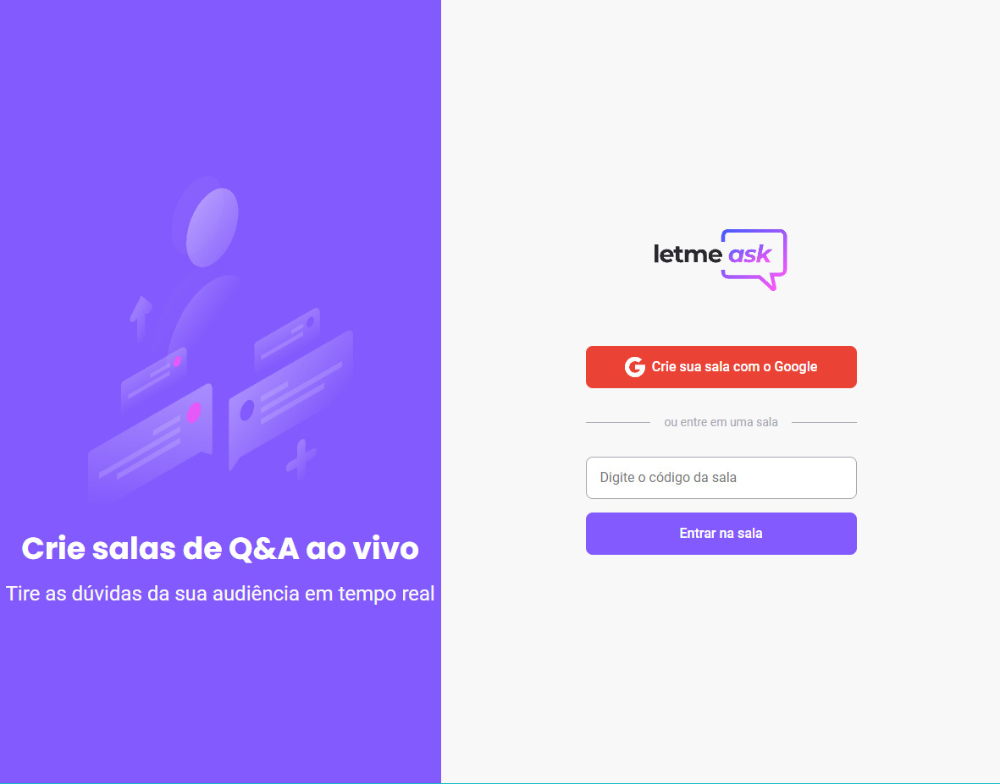

<p align="center">
    <a href="https://nlw-together-reactjs-36cd2.web.app"></a>
</p>

<h1 align="center">
    
</h1>

<br>

## 💻 Projeto

Letmeask é perfeito para criadores de conteúdos poderem criar salas de Q&A com o seu público, de uma forma muito organizada e democrática.

Este é um projeto desenvolvido durante a **[Next Level Week Together](https://nextlevelweek.com/)**, apresentada dos dias 20 a 27 de Junho de 2021.

**Este projeto já está online, para acessar <a href="https://nlw-together-reactjs-36cd2.web.app">Clique aqui</a>**

<br>

## 🧪 Tecnologias

Esse projeto foi desenvolvido com as seguintes tecnologias:

- [React](https://reactjs.org)
- [Firebase](https://firebase.google.com/)
- [TypeScript](https://www.typescriptlang.org/)

## 🚀 Como executar

Clone o projeto e acesse a pasta do mesmo.

```bash
$ git clone https://github.com/egfs1/nlw-06-reactjs.git
$ cd nlw-06-reactjs
```

Para iniciá-lo, siga os passos abaixo:
```bash
# Instalar as dependências
$ yarn
# Iniciar o projeto
$ yarn start
```
O app estará disponível no seu browser pelo endereço http://localhost:3000.

Para adicionar as variáveis ambientes, é necessario criar uma conta no [Firebase](https://firebase.google.com/), um projeto e um Web App. Depois adicionar as variáveis em um arquivo **.env.local**

```
REACT_APP_API_KEY=
REACT_APP_AUTH_DOMAIN=
REACT_APP_DATABASE_URL=
REACT_APP_PROJECT_ID=
REACT_APP_STORAGE_BUCKET=
REACT_APP_MESSAGING_SENDER_ID=
REACT_APP_APP_ID=
```